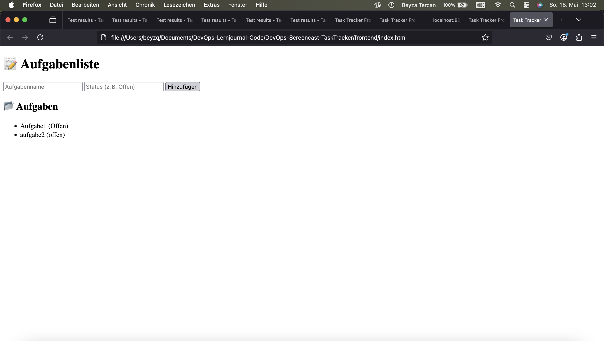

# DevOps Screencast – TaskTracker

Dieses Mini-Projekt wurde im Rahmen des Moduls DevOps entwickelt und dient als praktisches Beispiel zur Anwendung von Build-Tools, Versionskontrolle, automatisierten Tests und moderner Softwareentwicklung mit Spring Boot.

## 🎯 Ziel des Projekts

Ziel dieses Projekts war es, ein einfaches, aber praxisnahes Tool zu erstellen, das typische DevOps-Prinzipien wie Automatisierung, Versionierung, Testbarkeit und Wiederholbarkeit demonstriert. Besonders wichtig war es, den Unterschied zwischen manuellen Tests (z. B. in Postman) und automatisierten Unit-Tests greifbar zu machen und beide Methoden sinnvoll im Projekt einzusetzen.

Die Anwendung besteht aus einem Java/Spring Boot Backend und einem einfachen HTML/JavaScript-Frontend. Durch diese Trennung lässt sich das Frontend unabhängig vom Backend entwickeln und testen.

Dies ist ein einfaches Projektmanagement-Tool (Mini-Aufgabenliste), das im Rahmen des DevOps-Lernjournals erstellt wurde.

## 🛠️ Technologien

- Java 21
- Spring Boot 3.3.5
- Gradle 8.10.2
- Postman (für API-Tests)
- Git (lokal)

Die ausgewählten Technologien bilden die Grundlage für eine moderne Backend-Entwicklung:
- Java 21 ist eine aktuelle LTS-Version, die moderne Sprachfeatures bietet.
- Spring Boot 3.3.5 ermöglicht schnelles Setup und einfache Konfiguration von REST-Services.
- Gradle 8.10.2 dient als Build-Tool für das Kompilieren, Testen und Packen der Anwendung.
- Postman wird für manuelle Tests der REST-API genutzt.
- Git sorgt für nachvollziehbare Versionshistorie und ermöglicht kollaboratives Arbeiten.

---

## ✅ Implementierte Funktionen

Ursprünglich war geplant, das Projekt nach dem Prinzip des **Test-Driven Development (TDD)** umzusetzen. Aufgrund von technischen und zeitlichen Herausforderungen wurde jedoch entschieden, zunächst die Funktionalität direkt zu implementieren und anschliessend zu testen.

Der Entwicklungsprozess orientierte sich an den Prinzipien von DevOps, wobei sowohl Automatisierung als auch kontinuierliches Testen eine zentrale Rolle spielten.

---

### 1️⃣ Test schreiben

Bevor die eigentliche Funktionalität programmiert wurde, wurde ein automatisierter Test erstellt, um das gewünschte Verhalten zu definieren.

Dieser erste Test wurde bewusst vor der eigentlichen Implementierung geschrieben, um das gewünschte Verhalten des Systems festzulegen. Dies entspricht der TDD-Idee, dass Anforderungen in Form von Tests formuliert werden.

- Ziel: Sicherstellen, dass eine neue Aufgabe über `POST /tasks` erstellt und mit `GET /tasks` abgerufen werden kann.
- Testname: `testPostAndGetTasks()`
- Speicherort: `src/test/java/ch/zhaw/iwi/devops/task/TaskControllerTest.java`

✅ Testdurchlauf erfolgreich:

_PASS.png)

---

### 2️⃣ Implementierung

Die Funktionalität wurde in folgenden Klassen umgesetzt:

- `Task.java`: Datenmodell mit Feldern `name` und `status`
- `TaskController.java`: REST-Controller mit Endpunkten für POST und GET

Die Entscheidung, von TDD abzuweichen und zuerst funktionale Endpunkte zu implementieren, beruhte auf praktischen Herausforderungen, wie z. B. der initial fehlenden Teststruktur und Problemen mit der Testkonfiguration unter Spring Boot 3.

---

### 3️⃣ Refactoring

Nachdem die Funktionen erfolgreich getestet wurden, wurde der Code strukturell verbessert und dokumentiert. Der Test ist weiterhin automatisiert über `./gradlew test` aufrufbar.

Dabei wurde darauf geachtet, dass die Funktionalität erhalten bleibt, während der Code übersichtlicher und wartbarer wird. Die Tests dienen weiterhin als Sicherheitsnetz bei künftigen Änderungen.

---

## 🤖 Warum automatisierte Tests?

Automatisierte Tests wurden eingesetzt, um die Kernfunktionalität des Task-Trackers zuverlässig und wiederholbar zu überprüfen. Im Vergleich zu manuellen Tests mit Postman bieten automatisierte Tests folgende Vorteile:

- ✅ **Wiederholbarkeit**: Einmal geschriebene Tests lassen sich beliebig oft ausführen – auch nach Codeänderungen.
- ⏱️ **Zeitersparnis**: Kein manuelles Öffnen von Postman oder Eintippen von JSON-Daten nötig.
- 🧩 **Frühzeitige Fehlererkennung**: Änderungen am Code führen bei Bedarf direkt zu Testfehlschlägen.
- 🧪 **Integration in CI/CD-Pipelines**: Tests können automatisch bei jedem Git-Push oder Deployment ausgeführt werden.

Außerdem lassen sich durch automatisierte Tests Szenarien abbilden, die in Postman nur mühsam simuliert werden können – z. B. mehrere aufeinanderfolgende API-Aufrufe mit Zwischenvergleichen oder komplexe Assertions. Diese Testlogik ist im Testcode wesentlich besser wartbar und dokumentiert.

### Getestetes Verhalten

Der automatisierte Test `testPostAndGetTasks()` prüft folgendes:

1. Eine neue Aufgabe mit einem bestimmten Namen und Status wird per `POST /tasks` erstellt.
2. Dieselbe Aufgabe wird anschliessend über `GET /tasks` wiedergefunden.
3. Der Name und der Status stimmen mit den erwarteten Werten überein.

Der Test deckt damit sowohl die Erstellung als auch die Konsistenz der gespeicherten Daten ab – ein wichtiger Aspekt zur Sicherstellung der API-Funktionalität.

## 🧪 Manuelle Tests mit Postman

Neben automatisierten Tests wurde die API auch manuell über **Postman** getestet.

Manuelle Tests waren insbesondere in der Anfangsphase hilfreich, um die API-Endpunkte zu überprüfen, bevor automatisierte Tests stabil liefen. Auch zum Debugging bei Testfehlschlägen bietet Postman eine gute visuelle Unterstützung.

### 🔹 POST `/tasks`

- Erstellt eine neue Aufgabe
- Beispielanfrage:
  ```json
  {
    "name": "Erste Aufgabe",
    "status": "Offen"
  }
  ```


---

### 🔹 GET `/tasks`

- Gibt alle erstellten Aufgaben als JSON-Array zurück.


---

## ⚠️ Herausforderungen beim Testen

Während der Entwicklung traten mehrere Herausforderungen auf:
- Die erste Version des Tests konnte nicht ausgeführt werden, da der Server-Port bereits von einer anderen Instanz belegt war.
- Das Umsetzen eines echten TDD-Prozesses gestaltete sich schwierig, da Spring Boot 3 und Java 21 einige zusätzliche Konfigurationsschritte (z. B. Preview Features, Annotationen) erforderlich machten.
- Ein Test scheiterte zunächst, da `LocalServerPort` nicht korrekt importiert oder unterstützt wurde.

Diese Probleme konnten jedoch nach und nach identifiziert und gelöst werden. Sie zeigen, wie wichtig eine funktionierende Testumgebung ist und wie nützlich automatisierte Tests zur Fehlersuche sind.

---

## 🧩 Weiterentwicklung

Als nächster Schritt wurde ein separates Frontend in einem eigenen Ordner `frontend` erstellt. Dieses besteht aus einer einfachen `index.html`, die per JavaScript Aufgaben anzeigt und hinzufügt. So können Benutzer:innen die Anwendung direkt im Browser testen – ohne Postman oder Terminal.

Weitere geplante Features:
- Aufgabenstatus ändern
- Aufgaben löschen
- Validierung und Fehlermeldungen im Frontend
- CSS zur besseren Darstellung

---

## 🔗 GitHub Repository

➡️ [DevOps-Screencast-TaskTracker](https://github.com/Beyzatrcn/DevOps-Screencast-TaskTracker.git)

---

## 🌐 Benutzeroberfläche (Frontend)

Um die Nutzung der REST-API ohne Tools wie Postman zu erleichtern, wurde ein einfaches Frontend entwickelt. Es befindet sich im Ordner `frontend/` und besteht aus einer HTML-Datei mit eingebettetem JavaScript.

### 🔹 Funktionen

Das Frontend ermöglicht:
- die Eingabe von Aufgabenname und Status,
- das Absenden neuer Aufgaben an das Backend (`POST /tasks`),
- das Laden und Anzeigen aller gespeicherten Aufgaben (`GET /tasks`).

Benutzer:innen können damit die Anwendung direkt im Browser testen.

### 🖼️ Screenshot



### 🔧 Voraussetzungen

- Das Spring Boot Backend muss lokal unter `http://localhost:8080` laufen.
- Der Browser greift über `file:///` auf die `frontend/index.html` zu.

### 💡 Vorteile des Frontends

- Keine Installation zusätzlicher Tools notwendig (z. B. Postman).
- Bessere Benutzererfahrung beim Testen der REST-API.
- Schnellere Rückmeldung bei der Eingabe von Aufgaben.

---